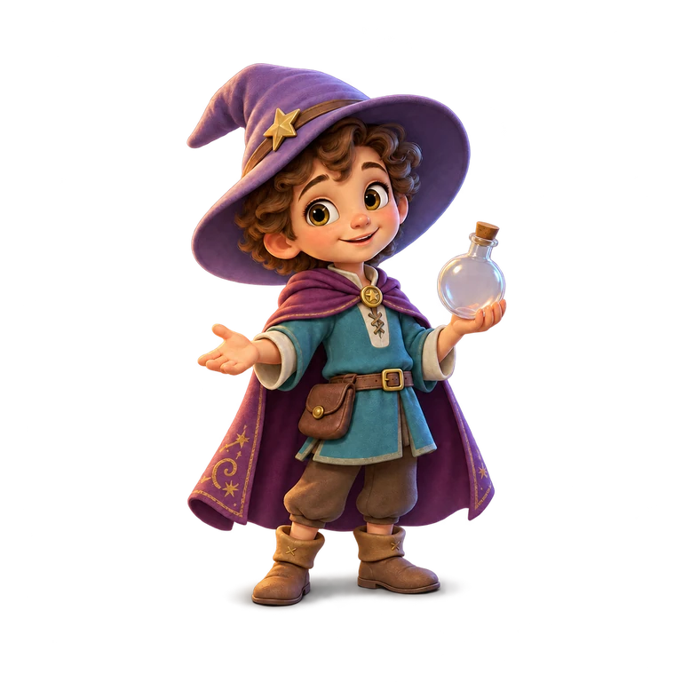
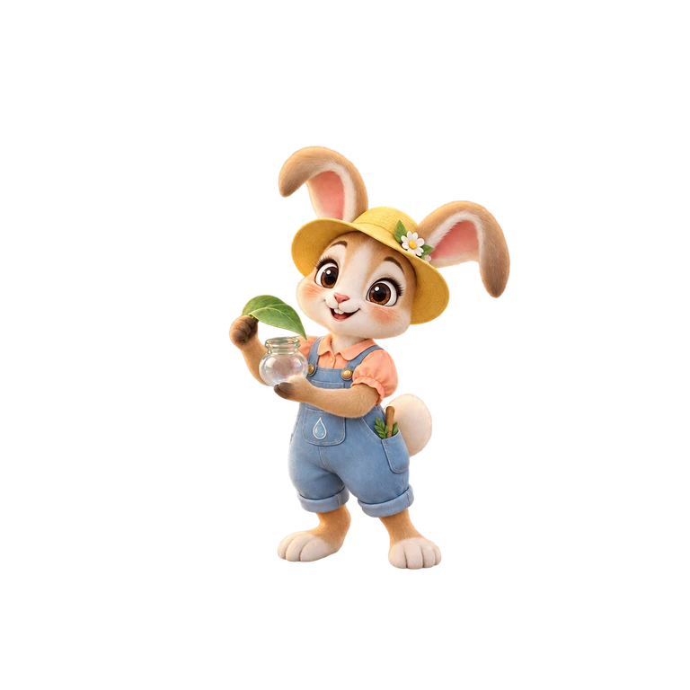
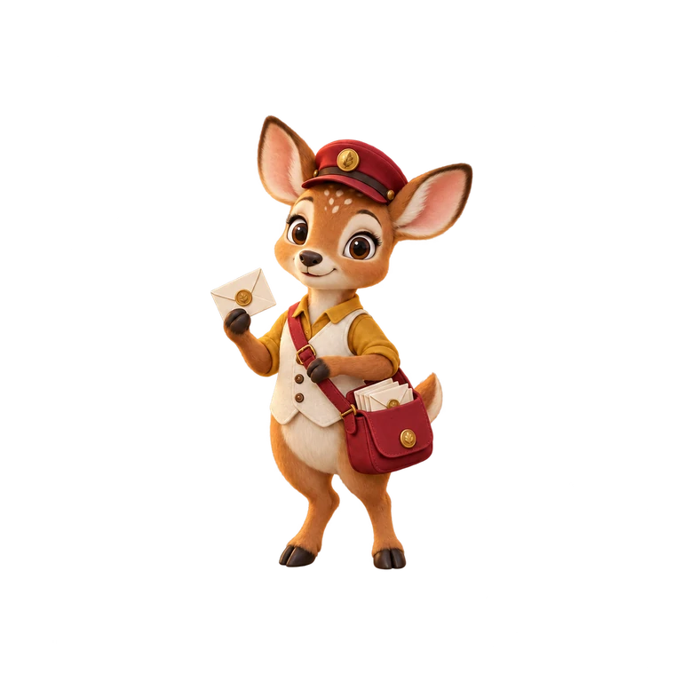
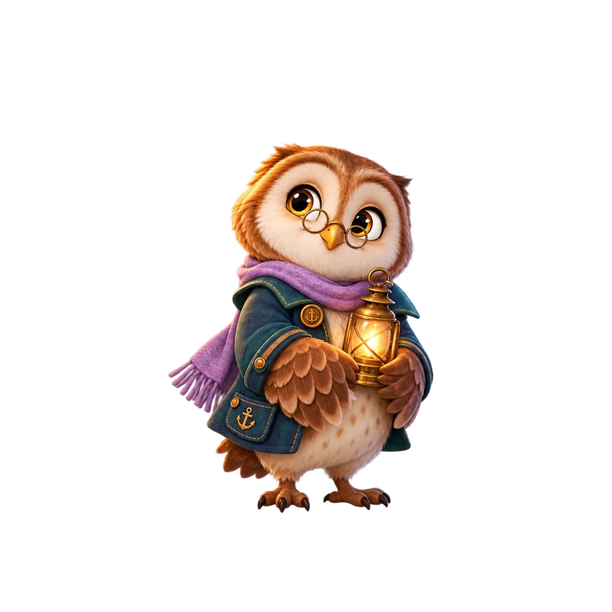
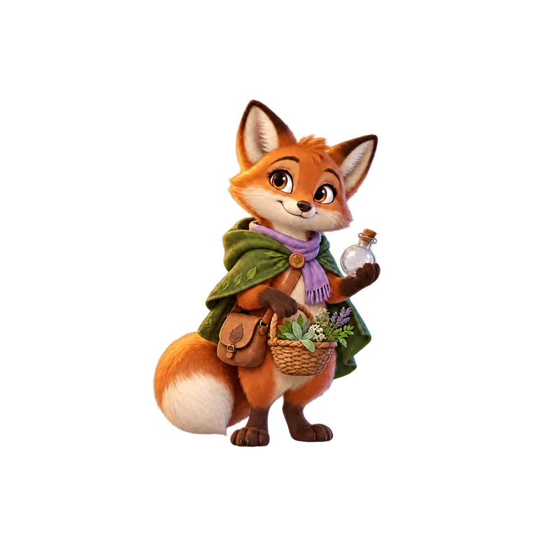
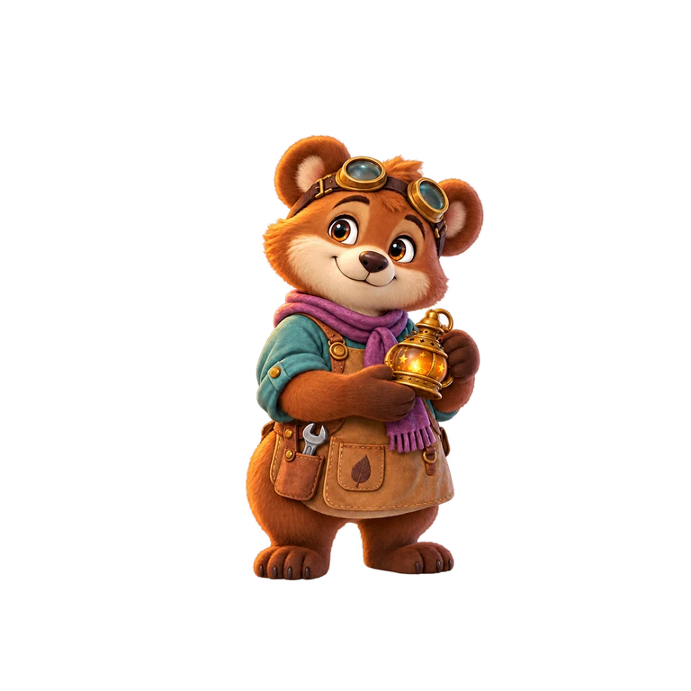

# 暮光森林角色圖鑑

[世界觀](README.md) · [美術來源與重建](art/README.md)

## 角色速覽

| 米洛 | 露米 | 奧利 |
| --- | --- | --- |
|  |  |  |

| 諾爾 | 菲恩 | 布諾 |
| --- | --- | --- |
|  |  |  |

## 身分與口吻

| 角色 | 身分與個性 | 說話方式／示例 | 可延伸的小細節 |
| --- | --- | --- | --- |
| 米洛 | 人類工坊學徒；好奇、親切，也在學習。系列的陪伴主角，不是無所不知的老師 | 邀請一起觀察，不急著報答案。「我們先看看，哪裡還有空間？」 | 能承認不知道，會替朋友留位置 |
| 露米 | 兔子露珠採集師；敏銳、活潑，珍惜微小事物 | 輕快、具體，不堆疊幼兒語。「這顆露珠，像剛睡醒的星星！」 | 最大的露珠叫「小小」；口袋有給雲的糖 |
| 奧利 | 鹿森林郵差；可靠、體貼，照顧走得慢的朋友 | 清楚、爽朗，帶來消息而不催促。「蝸牛的請帖，我提早送。」 | 郵袋有裝迷路的風的暗袋 |
| 諾爾 | 貓頭鷹星燈看守人；安靜、細心，留意容易被忽略的人 | 短句、留白，有溫柔的觀察。「這盞燈，留給晚歸的人。」 | 替怕黑的燈做夜燈；數星星數到打呵欠 |
| 菲恩 | 狐狸草藥師；靈巧、愛研究，樂於修正猜想 | 以氣味、葉片與發現說話，不裝神祕。「配方這一格，留給新發現。」 | 落葉當書籤；配方保留空白 |
| 布諾 | 熊火光修理師；穩重、耐心，擅長讓物件重新運作 | 樸實、有夥伴感。「沒關係，搭檔。我們再試一回。」 | 工具箱裡睡著小貓；珍藏修心情的螺絲 |

**芮雅**是已出現在 [星燈小徑案件](../games/detective/starlight.md) 的夜蛾照護員，關心剛孵化的夜蛾，與米洛、諾爾及奧利共同修復通行問題。現有設定未指定物種、服裝與獨立立繪；不可替她套用其他居民的圖像。案件真相留在案件文件。

## 同場角色尺度

角色在同一地面深度並排時，以奧利的自然站姿輪廓為 1.00 校準視覺身高；帽沿、耳尖、羽角、提燈、披風與魔法光暈不拿來決定縮放。這是跨遊戲的畫面比例基準，不是角色的公分身高；遠近透視仍由場景座標調整。各角色有頭身與體型差異，但不把任何居民畫成另一位的巨人或矮人。

| 角色 | 同深度視覺身高 | 造型差異 |
| --- | ---: | --- |
| 露米 | 約 0.96 | 兔耳高於頭頂，身體仍接近其他居民 |
| 奧利 | 1.00 | 輕巧的小鹿身形，郵袋不計入身高 |
| 諾爾 | 約 0.98 | 羽身較寬、站姿較圓，提燈不放大本體 |
| 菲恩 | 約 1.03 | 狐狸身形較修長，尾巴不計入身高 |
| 米洛 | 約 1.05 | 人類學徒略高，巫師帽與偵探帽不計入身高 |
| 布諾 | 約 1.10 | 肩背較寬厚，是這組角色中稍高的一位 |

星燈小徑開場的守燈亭是第一個同框驗收點：奧利、諾爾與米洛腳底落在相近的地面線，角色輪廓高度只作上述小幅差異。角色換姿勢時錨點跟著腳底，不以 512px 影格大小當角色身高。

## 造型基準與原圖

上方速覽直接引用現役 WebP；「造型母圖」連向完整 PNG 原稿，製作新圖時優先使用它。表情、步態與正視修正是同一角色的衍生姿勢，不是不同角色。原稿尺寸、提示與生成紀錄以所連的 manifest 為準；有透明殘點的早期原稿仍需重新驗收，不能把它當成已通過新動畫規格。

### 米洛（milo）

栗棕捲髮、淡紫星飾巫師帽、青綠上衣、梅紫披風、棕靴與小瓶。

[造型母圖](art/characters/milo/apprentice-v2.png) · [感謝表情原圖](art/characters/milo/apprentice-celebrate-v1.png) · [造型來源紀錄](art/manifests/manifest.json)

案件服裝衍生：[星燈小徑開場變裝關鍵六幀](art/characters/milo/milo-detective-transform-v2-keys.png) · [銜接六幀](art/characters/milo/milo-detective-transform-v2-inbetweens.png) · [向左入場步態六幀](art/characters/milo/milo-opening-left-walk-v1.png)；服裝用途見[案件設計](../games/detective/starlight.md)。

### 露米（lumi）

米色兔子、花飾草帽、桃色上衣、藍色吊帶褲；葉片與玻璃露珠罐。

[造型母圖](art/characters/lumi/visitor-rabbit-dew-v2.png) · [感謝表情原圖](art/characters/lumi/visitor-rabbit-happy-v1.png) · [造型來源紀錄](art/manifests/batch-2-manifest.json)

其他姿勢：[正視修正原圖](art/characters/lumi/guest-rabbit-front-gaze-v2.png) · [六幀步態母圖](art/characters/lumi/guest-rabbit-walk-v1.png)

### 奧利（oli）

無角小鹿、紅郵帽、芥黃上衣、米白背心、紅郵袋與信封；勿依鹿的印象自行加角。

[造型母圖](art/characters/oli/visitor-deer-post-v4.png) · [感謝表情原圖](art/characters/oli/visitor-deer-happy-v1.png) · [造型來源紀錄](art/manifests/batch-2-manifest.json)

其他姿勢：[六幀步態母圖](art/characters/oli/guest-deer-walk-v1.png)

星燈小徑開場：[背向步態六幀](art/characters/oli/oli-opening-rear-walk-v1.png) · [尋路與錯愕六幀](art/characters/oli/oli-opening-reactions-v1.png)。

### 諾爾（noel）

棕／米白羽毛、圓眼鏡、梅紫圍巾、青綠外套與黃銅提燈。

[造型母圖](art/characters/noel/visitor-owl-keeper-v1.png) · [感謝表情原圖](art/characters/noel/visitor-owl-happy-v1.png) · [造型來源紀錄](art/manifests/batch-2-manifest.json)

其他姿勢：[正視修正原圖](art/characters/noel/guest-owl-front-gaze-v2.png) · [六幀步態母圖](art/characters/noel/guest-owl-walk-v1.png)

星燈小徑開場：[傾聽與困惑六幀](art/characters/noel/noel-opening-reactions-v1.png)。

### 菲恩（finn）

赤褐／米白狐狸、綠披肩、淡紫圍巾、草藥籃與側背包；保留完整尾巴。

[造型母圖](art/characters/finn/forest-visitor-v3.png) · [感謝表情原圖](art/characters/finn/visitor-fox-happy-v1.png) · [造型來源紀錄](art/manifests/manifest.json)

其他姿勢：[正視修正原圖](art/characters/finn/guest-fox-front-gaze-v2.png) · [六幀步態母圖](art/characters/finn/guest-fox-walk-v1.png)

### 布諾（bruno）

棕熊、額上護目鏡、青綠上衣、紫圍巾、棕皮工作圍裙與工具口袋，手持暖光提燈；穩重圓厚的身形。

[造型母圖](art/characters/bruno/visitor-bear-artisan-v2.png) · [感謝表情原圖](art/characters/bruno/visitor-bear-happy-v1.png) · [造型來源紀錄](art/manifests/batch-2-manifest.json)

其他姿勢：[六幀步態母圖](art/characters/bruno/guest-bear-walk-v1.png)

## 使用順序

1. 先讀身分與口吻，再看造型母圖；不以姿勢修正版覆蓋人物身分。
2. 感謝表情來源見 [reactions](art/manifests/reactions-manifest.json)，客人動作見 [步態](art/manifests/guest-animation-manifest.json) 與 [正視修正](art/manifests/guest-gaze-manifest.json)。
3. 實際載入、縮放與角色順序見 [art.ts](../../src/games/magic-workshop/art.ts)；工坊出場順序不是所有遊戲必守的故事規則。
4. 新姿勢先定義格位、錨點、安全留白，原圖與每個切出幀皆須驗收；完整規範見 [AGENTS](../../AGENTS.md)。
